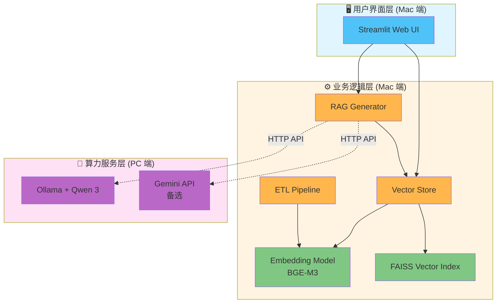
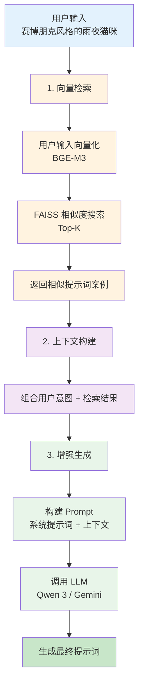
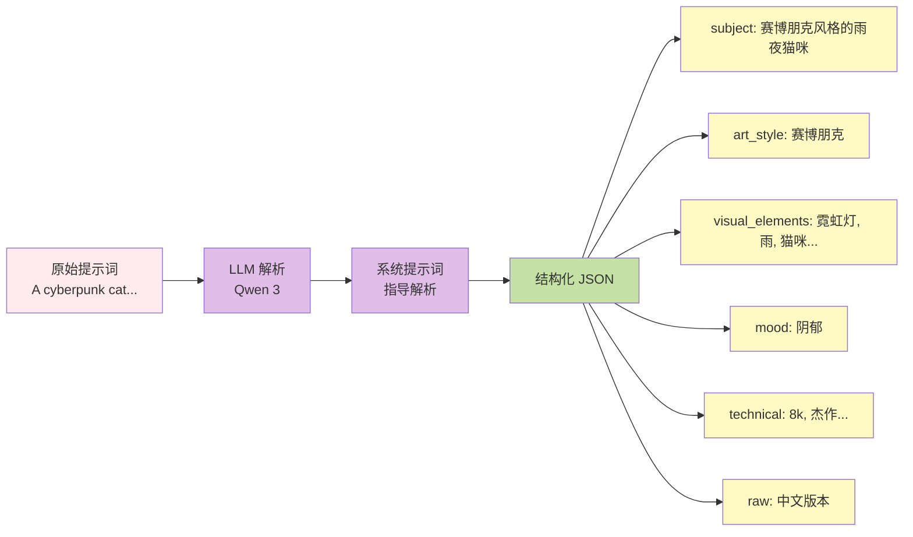
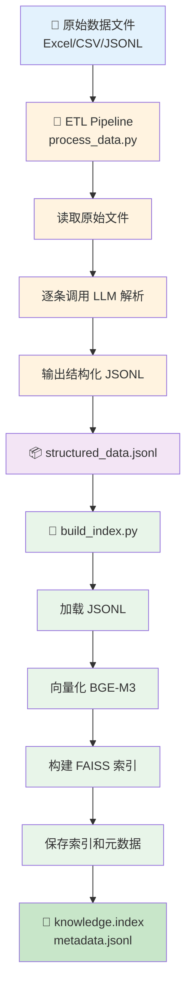
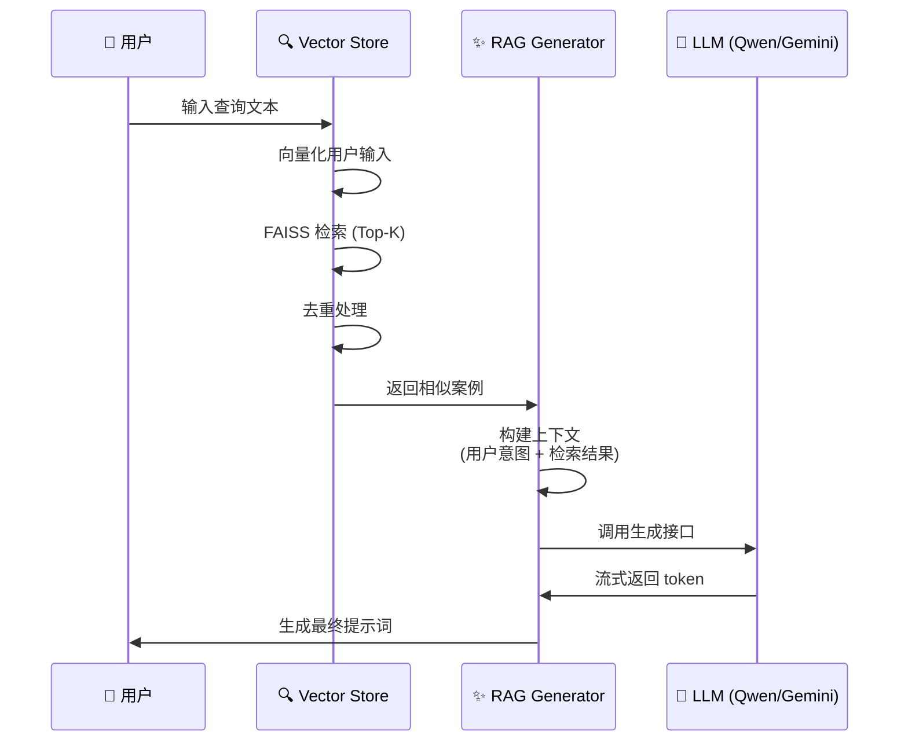
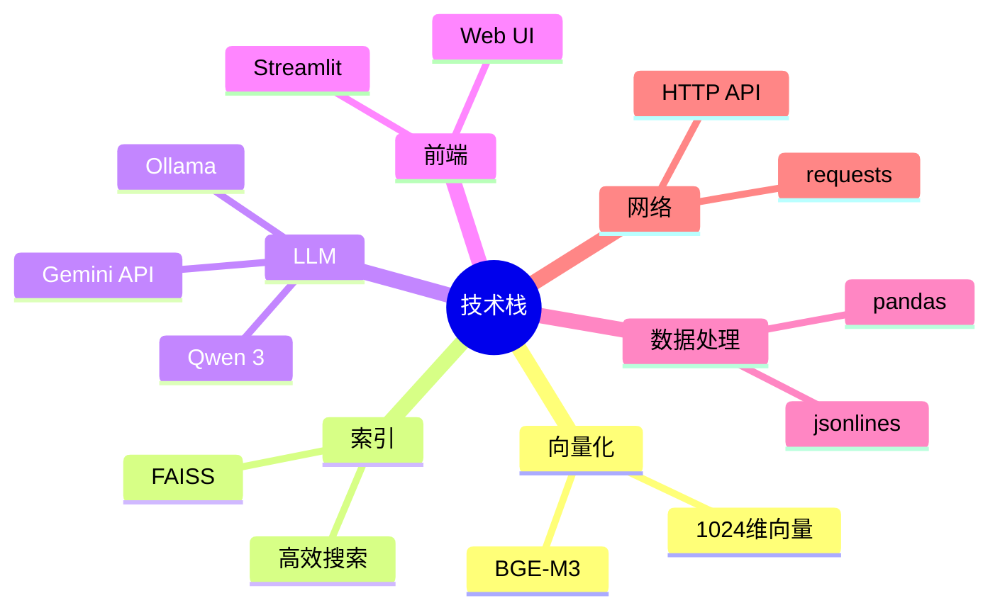
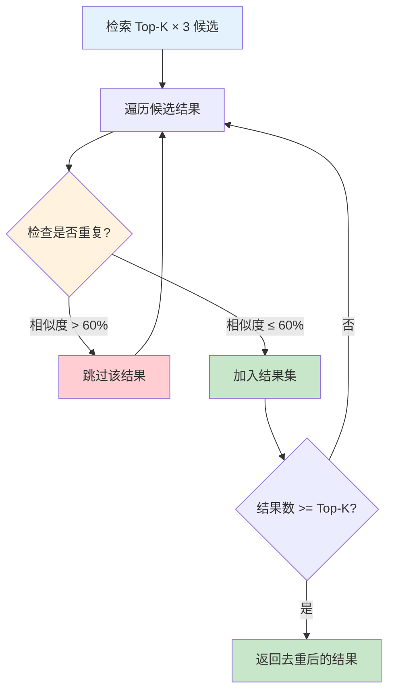
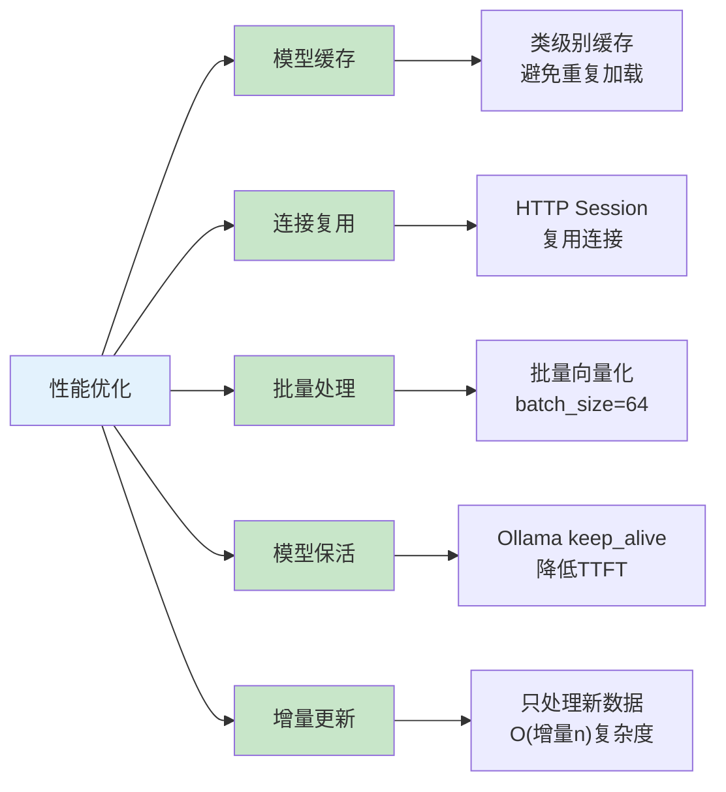

# PromptRAG-PIC 系统原理文档

> 💡 **图表说明**：本文档使用 Mermaid 图表，适用于支持 Mermaid 的博客平台（GitHub、GitLab、Notion、Hugo、Hexo 等）。
> 
> 如果您的博客平台不支持 Mermaid，可以使用在线工具（如 [Mermaid Live Editor](https://mermaid.live/)）将 Mermaid 代码转换为图片后插入。

## 📋 目录

1. [系统概述](#系统概述)
2. [架构设计](#架构设计)
3. [核心原理](#核心原理)
4. [数据流程](#数据流程)
5. [技术栈](#技术栈)
6. [关键算法](#关键算法)
7. [性能优化](#性能优化)

---

## 系统概述

PromptRAG-PIC 是一个基于 **RAG（Retrieval-Augmented Generation，检索增强生成）** 技术的智能绘图提示词生成系统。该系统能够从大量历史提示词中检索相似案例，并结合用户意图生成高质量的绘图提示词。

### 核心价值

- **知识复用**：从历史提示词库中检索相关案例，避免重复创作
- **智能增强**：利用大语言模型理解用户意图，生成专业级提示词
- **分布式部署**：Mac 端处理业务逻辑，PC 端提供 AI 算力，充分利用硬件资源
- **本地化部署**：数据隐私安全，无订阅成本

---

## 架构设计

### 整体架构



### 组件说明

#### 1. **用户界面层** (`app.py`)
- **技术**：Streamlit
- **功能**：
  - 接收用户输入（中文描述）
  - 展示检索结果和生成内容
  - 支持多种生成风格（通用、艺术、摄影、东方美学）
  - 支持流式输出，实时显示生成过程

#### 2. **RAG 生成器** (`rag_generator.py`)
- **职责**：协调检索和生成流程
- **核心方法**：
  - `generate()`: 同步生成
  - `stream_generate()`: 流式生成
  - `_build_context()`: 构建检索上下文

#### 3. **向量存储** (`vector_store.py`)
- **职责**：向量化、索引构建、相似度检索
- **核心功能**：
  - 使用 BGE-M3 模型生成向量
  - 构建 FAISS 索引
  - 支持增量更新
  - 去重逻辑（模糊匹配）

#### 4. **ETL 管道** (`etl_pipeline.py`)
- **职责**：数据清洗和结构化
- **功能**：
  - 读取 Excel/CSV/JSONL
  - 调用 LLM 解析原始提示词
  - 输出结构化 JSONL

#### 5. **LLM 客户端**
- **OllamaClient** (`ollama_client.py`): 连接本地 Ollama 服务
- **GeminiClient** (`gemini_client.py`): 连接 Google Gemini API

---

## 核心原理

### RAG 工作流程

RAG（Retrieval-Augmented Generation）是一种结合信息检索和文本生成的技术。在本系统中，RAG 的工作流程如下：



### 向量检索原理

#### 1. **文本向量化**

使用 **BGE-M3** 模型将文本转换为高维向量（1024 维）：

```python
# 示例：构建检索文本
search_text = "主体:赛博朋克猫咪 风格:赛博朋克 元素:霓虹灯,雨,城市 氛围:阴郁 技术:8k,杰作"

# 向量化
embedding = encoder.encode([search_text])  # shape: (1, 1024)
```

#### 2. **FAISS 索引**

使用 **FAISS (Facebook AI Similarity Search)** 构建向量索引：

- **索引类型**：`IndexFlatL2`（L2 距离，欧氏距离）
- **优势**：精确搜索，适合中小规模数据（< 100万条）
- **存储**：向量索引 + 元数据 JSONL

```python
# 构建索引
index = faiss.IndexFlatL2(dimension=1024)
index.add(embeddings)  # 添加向量
faiss.write_index(index, "db/knowledge.index")
```

#### 3. **相似度搜索**

```python
# 查询向量化
query_vector = encoder.encode([user_input])

# 检索 Top-K
distances, indices = index.search(query_vector, top_k=5)

# 距离越小，相似度越高
similarity = 1 / (1 + distance)
```

### 结构化解析原理

原始提示词（可能是英文或中文）需要被解析为结构化数据，以便更好地进行检索和生成。

#### 解析流程



**结构化输出示例：**

```json
{
  "subject": "赛博朋克风格的雨夜猫咪",
  "art_style": "赛博朋克",
  "visual_elements": ["霓虹灯", "雨", "猫咪", "城市街道"],
  "mood": "阴郁",
  "technical": ["8k", "杰作", "高度细节", "光线追踪"],
  "raw": "赛博朋克风格的雨夜猫咪，霓虹灯，8k 杰作"
}
```

#### 检索文本构建

检索时，将多个字段组合成检索文本：

```python
def _build_search_text(item):
    parts = [
        item.get("subject", ""),
        item.get("art_style", ""),
        *item.get("visual_elements", []),
        item.get("mood", ""),
        *item.get("technical", [])
    ]
    return " ".join(parts)
```

这样可以在多个维度上进行语义匹配。

---

## 数据流程

### 数据准备阶段



### 运行时流程



---

## 技术栈

### 核心依赖



**技术栈表格：**

| 组件 | 技术 | 用途 |
|------|------|------|
| **向量模型** | BAAI/bge-m3 | 文本向量化（1024 维） |
| **向量索引** | FAISS | 高效相似度搜索 |
| **LLM 服务** | Ollama + Qwen 3 | 本地大语言模型 |
| **LLM 备选** | Google Gemini API | 云端大语言模型 |
| **Web 框架** | Streamlit | 用户界面 |
| **数据处理** | pandas, jsonlines | 数据读取和处理 |
| **HTTP 客户端** | requests | API 调用 |

### 模型选择

#### Embedding 模型：BGE-M3

- **优势**：
  - 多语言支持（中英文混合）
  - 1024 维向量，语义表示能力强
  - 开源免费，可本地部署
- **备选**：`sentence-transformers/clip-ViT-B-32`（图像语义对齐，512 维）

#### LLM 模型：Qwen 3

- **推荐版本**：32B 或更高
- **优势**：
  - 中文理解能力强
  - 支持长上下文
  - 可通过 Ollama 本地部署
- **备选**：Gemini 1.5 Flash / Pro（云端 API）

---

## 关键算法

### 1. 增量索引更新

系统支持增量更新索引，避免重复处理已有数据：

```python
def build_index(self, jsonl_path, incremental=True):
    if incremental and self.exists():
        # 读取现有元数据
        existing_raws = set(...)
        
        # 找出新增记录
        new_items = [item for item in all_items 
                     if item.get('raw') not in existing_raws]
        
        # 只处理新增数据
        new_embeddings = encoder.encode(new_texts)
        index.add(new_embeddings)  # 追加到现有索引
    else:
        # 全量重建
        ...
```

**优势**：
- 节省计算资源
- 支持数据持续更新
- 避免重复向量化

### 2. 去重算法

检索结果使用模糊匹配去重，避免返回过于相似的结果：



**算法实现：**

```python
def search(self, query, top_k=5):
    # 检索更多候选（3倍数量）
    candidate_k = top_k * 3
    distances, indices = index.search(query_vector, candidate_k)
    
    results = []
    accepted_raws = []
    
    for item, dist in candidates:
        raw_text = item.get('raw', '')
        
        # 模糊去重检查
        is_duplicate = False
        for existing_raw in accepted_raws:
            similarity = difflib.SequenceMatcher(
                None, raw_text, existing_raw
            ).ratio()
            if similarity > 0.6:  # 相似度阈值
                is_duplicate = True
                break
        
        if not is_duplicate:
            results.append((item, dist))
            accepted_raws.append(raw_text)
            
            if len(results) >= top_k:
                break
    
    return results
```

**原理**：
- 使用 `difflib.SequenceMatcher` 计算文本相似度
- 相似度 > 60% 视为重复
- 从候选集中筛选出多样化的结果

### 3. 上下文构建策略

RAG Generator 将检索结果组织成结构化上下文：

```python
def _build_context(self, user_intent, retrieved_items):
    context = f"用户意图: {user_intent}\n\n参考素材（共{len(retrieved_items)}条）:\n"
    
    for i, item in enumerate(retrieved_items, 1):
        parts = []
        if item.get('subject'):
            parts.append(f"主体:{item['subject']}")
        if item.get('art_style'):
            parts.append(f"风格:{item['art_style']}")
        # ... 其他字段
        
        context += f"{i}. {', '.join(parts)}\n"
    
    return context
```

**设计考虑**：
- 突出关键字段（主体、风格、元素）
- 限制字段数量，避免上下文过长
- 结构化格式，便于 LLM 理解

### 4. 流式生成

支持流式输出，提升用户体验：

```python
def stream_generate(self, prompt, system=None):
    # Ollama 流式 API
    with session.post(url, json=data, stream=True) as r:
        for line in r.iter_lines():
            obj = json.loads(line)
            if obj.get("done"):
                break
            token = obj.get("response", "")
            if token:
                yield token  # 逐步返回 token
```

**优势**：
- 降低首字延迟（TTFT）
- 实时反馈，提升交互体验
- 支持长文本生成

---

## 性能优化

### 优化策略总览



### 1. 模型缓存

Embedding 模型使用类级别缓存，避免重复加载：

```python
class VectorStore:
    _encoder_cache = {}  # 类级别缓存
    
    def __init__(self):
        if self.model_name not in VectorStore._encoder_cache:
            encoder = SentenceTransformer(...)
            VectorStore._encoder_cache[self.model_name] = encoder
        self.encoder = VectorStore._encoder_cache[self.model_name]
```

**效果**：首次加载后，后续实例直接复用，节省内存和时间。

### 2. HTTP 连接复用

Ollama 客户端使用 `requests.Session` 复用连接：

```python
class OllamaClient:
    def __init__(self):
        self.session = requests.Session()  # 复用连接
```

**优势**：
- 减少 TCP/TLS 握手开销
- 降低延迟
- 提升并发性能

### 3. 批量向量化

向量化时使用批量处理：

```python
embeddings = encoder.encode(
    texts, 
    show_progress_bar=True, 
    batch_size=64  # 批量大小
)
```

### 4. Ollama 保活机制

通过 `keep_alive` 参数保持模型在内存中：

```python
data = {
    "model": self.model,
    "options": {
        "keep_alive": "5m"  # 保持 5 分钟
    }
}
```

**效果**：
- 降低首请求延迟（TTFT）
- 避免重复加载模型
- 提升响应速度

### 5. 增量索引更新

只处理新增数据，避免全量重建：

- 基于 `raw` 字段去重
- 只向量化新数据
- 追加到现有索引

**性能提升**：
- 处理时间从 O(n) 降低到 O(Δn)
- 支持大规模数据持续更新

---

## 系统特性

### 1. 多风格支持

系统支持多种生成风格，通过不同的系统提示词实现：

- **通用优化**：平衡细节和结构
- **艺术幻梦**：强调想象力和视觉冲击
- **摄影质感**：专注光影和真实感
- **东方美学**：融入传统文化元素

### 2. 双后端支持

- **Ollama（本地）**：通过 HTTP API 连接 PC 端
- **Gemini（云端）**：通过 Google API 调用

用户可在界面中切换后端。

### 3. 灵活检索模式

- **Top-K > 0**：RAG 模式，基于检索结果生成
- **Top-K = 0**：直接生成模式，跳过检索

### 4. 数据格式兼容

支持多种输入格式：
- Excel (.xlsx, .xls)
- CSV (.csv)
- JSONL (.jsonl)

---

## 总结

PromptRAG-PIC 系统通过 **RAG 技术**实现了智能提示词生成：

1. **知识库构建**：将历史提示词向量化并建立索引
2. **语义检索**：基于用户意图检索相似案例
3. **增强生成**：结合检索结果和 LLM 生成高质量提示词

系统采用**分布式架构**，充分利用硬件资源，同时保证数据隐私和本地化部署的优势。

---

## 参考资料

- [RAG 论文](https://arxiv.org/abs/2005.11401)：Retrieval-Augmented Generation for Knowledge-Intensive NLP Tasks
- [FAISS 文档](https://github.com/facebookresearch/faiss)
- [BGE-M3 模型](https://huggingface.co/BAAI/bge-m3)
- [Ollama 文档](https://ollama.ai/docs)

---

*最后更新：2024年*
